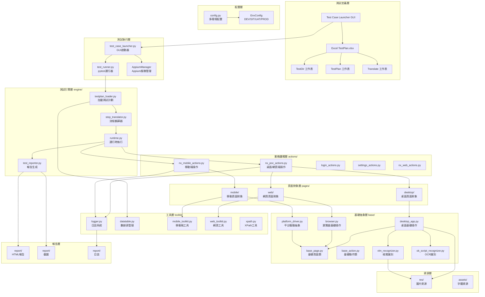
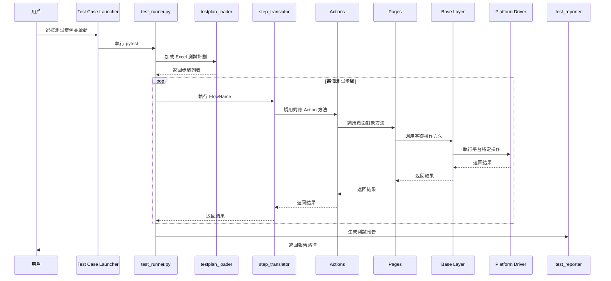
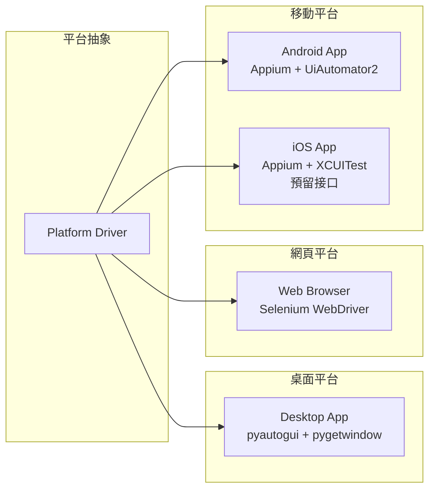
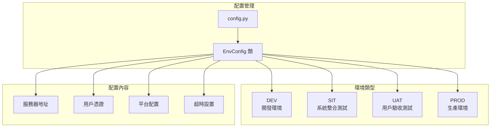
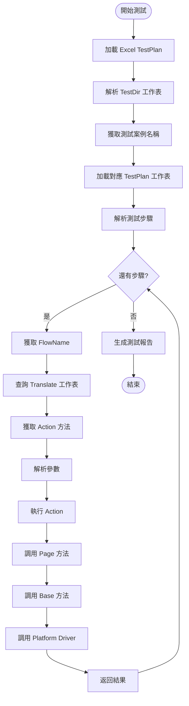

# Nx Witness 自動化測試框架架構圖

## 📐 整體架構圖

## 🔄 執行流程圖

## 🏗️ 分層架構詳解

### 1. 測試定義層
- **Excel TestPlan.xlsx**: 包含所有測試定義
  - `TestDir`: 測試案例目錄，映射 TestName 到工作表
  - `TestPlan`: 測試步驟定義（StepNo, FlowName, Params）
  - `Translate`: 流程名稱到 Action 方法的映射
- **Test Case Launcher**: GUI 界面，用於選擇和執行測試

### 2. 測試執行層
- **test_case_launcher.py**: 
  - 提供 GUI 界面
  - 管理 Appium Server 啟動/停止
  - 多線程執行測試
- **test_runner.py**: pytest 測試運行器，執行測試邏輯

### 3. 測試引擎層
- **testplan_loader.py**: 從 Excel 加載測試計劃
- **step_translator.py**: 將 FlowName 翻譯為 Action 方法調用
- **runtime.py**: 執行測試步驟的運行時環境
- **test_reporter.py**: 生成 HTML 測試報告

### 4. 業務邏輯層
- **nx_poc_actions.py**: 桌面/網頁端業務操作（登入、設置、錄影等）
- **nx_mobile_actions.py**: 移動端業務操作
- **nx_web_actions.py**: 網頁端特定操作
- **login_actions.py**: 登入相關操作
- **settings_actions.py**: 設置相關操作

### 5. 頁面對象層
- **desktop/**: 桌面應用頁面對象
  - `login_page.py`, `main_page.py`, `settings_page.py` 等
- **web/**: 網頁頁面對象
  - `nx_cloud_web_page.py` 等
- **mobile/**: 移動應用頁面對象
  - `login_page.py`, `main_page.py`, `playback_page.py` 等

### 6. 基礎抽象層
- **desktop_app.py**: 桌面應用基礎操作（點擊、輸入、視窗管理等）
- **browser.py**: 瀏覽器基礎操作（Selenium WebDriver 封裝）
- **platform_driver.py**: 平台驅動抽象接口
- **base_page.py**: 頁面對象基礎類
- **base_action.py**: 動作基礎類
- **vlm_recognizer.py**: 視覺語言模型識別器
- **ok_script_recognizer.py**: OCR 文字識別器

### 7. 工具層
- **logger.py**: 統一日誌系統
- **datatable.py**: Excel 數據表管理
- **mobile_toolkit.py**: 移動端工具（Appium WebDriver 初始化）
- **web_toolkit.py**: 網頁工具
- **xpath.py**: XPath 工具函數

### 8. 配置層
- **config.py**: 多環境配置管理
  - `EnvConfig`: 環境配置類
  - 支援 DEV/SIT/UAT/PROD 環境切換
  - 管理平台特定配置（Desktop/Web/Mobile）

## 🌐 平台支援架構

## 🔧 環境配置架構

## 📊 數據流向圖

## 🎯 核心設計原則

1. **分層架構**: 清晰的職責分離，每層只關注自己的職責
2. **Excel 驅動**: 測試流程定義在 Excel，代碼只負責執行
3. **多平台支援**: 統一的接口，支援 Desktop/Web/Mobile
4. **多環境配置**: 支援多環境切換，無需修改代碼
5. **可擴展性**: 新增平台或功能只需擴展對應層級
6. **可維護性**: 業務邏輯與技術實現分離

## 📝 關鍵文件說明

| 文件/目錄 | 職責 | 關鍵類/函數 |
|---------|------|-----------|
| `test_case_launcher.py` | GUI 啟動器 | `TestCaseLauncher`, `AppiumManager` |
| `tests/test_runner.py` | pytest 運行器 | `get_test_data()`, `test_main_flow()` |
| `engine/testplan_loader.py` | 加載測試計劃 | `load_test_plan()` |
| `engine/step_translator.py` | 流程翻譯 | `StepTranslator.execute()` |
| `engine/runtime.py` | 運行時執行 | 執行測試步驟 |
| `engine/test_reporter.py` | 報告生成 | 生成 HTML 報告 |
| `actions/nx_poc_actions.py` | 桌面/網頁業務邏輯 | `NxPocActions` |
| `actions/nx_mobile_actions.py` | 移動端業務邏輯 | `NxMobileActions` |
| `base/desktop_app.py` | 桌面基礎操作 | `DesktopApp` |
| `base/browser.py` | 瀏覽器基礎操作 | `Browser` |
| `base/platform_driver.py` | 平台驅動抽象 | `PlatformDriver` |
| `toolkit/mobile_toolkit.py` | 移動端工具 | `create_appium_driver()` |
| `config.py` | 配置管理 | `EnvConfig` |

---

**最後更新**: 2026-01-23  
**架構版本**: v2.0
